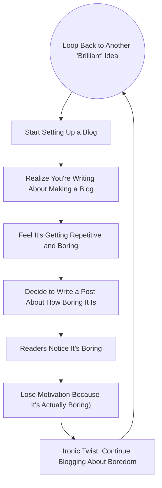

# Setting Up a Boring Markdown Tech Blog in 2025

I'm sharing *how* I'm creating my blog *while* I'm creating my blog.

I'm using [MkDocs](https://www.mkdocs.org/) and [Material for
MkDocs](https://squidfunk.github.io/mkdocs-material/) as my static site builder.
I know I'll look like a corporate drone, but I appreciate how easy and
full-featured it is for code examples, diagrams, and such. I used it for my
Python library [WordSiv](https://wordsiv.com) and it was enjoyable to use.

I'm using [uv](https://docs.astral.sh/uv/concepts/tools/) to isolate
`mkdocs-material` dependencies, so we'll dip our toes in managing Python versions
and packages.

<!-- more -->

## Before Getting Started

I want to document some things I do in a project like this, which I'd normally skip over. I hope it'll benefit you!

### Making Cursor Less Annoying

I'm editing this markdown file in [Cursor](https://www.cursor.com/), it's great!
However, LLM autocomplete is annoying for markdown. How would it know what I
want to write before I write it? I think when I'm writing, and the autocomplete
clouds my thinking with gobbledygook. So type <kbd>⌘</kbd> + <kbd>shift</kbd> +
<kbd>p</kbd>, select "Preferences: Open User Settings (JSON)", and add this:
```json
"cursor.cpp.disabledLanguages": [
    "markdown"
]
```

Couldn't I just use VS Code for this? Sure, but it's nice to have an LLM at your
disposal for later proofreading, and mindless content rearranging and stuff.

### Wrapping Markdown

As a programmer, we're afraid of being judged by our source code, so we'll want
our Markdown lines to wrap at a certain line length. Likely you're reading on
the rendered HTML version of this blog, but hey, I'll install [Rewrap] so we can
select text and <kbd>alt</kbd> + <kbd>q</kbd> to wrap lines. I mean, it's kinda
nicer to read in the editor too as I type. Why? We aren't used to reading [too
many words on a line][butterick][^2].

Bored yet? Mission accomplished, this is a boring blog post about a boring tech
blog.

### Init the Git

You know this!
```sh
mkdir tallpauley-blog
cd tallpauley-blog
git init
```
I won't get into Git usage much, but I'm going to "commit early, commit often,"
especially with this file `tech-blog.md`, so I don't lose any writing! I will
mention, I use [oh my zsh](https://ohmyz.sh/) for git aliases, because who wants
to type?

### Managing CPython and Package Versions

This part historically has been a chore, but I think it's getting better/easier.
My last project I used [mise-en-place](https://mise.jdx.dev/) and
[Poetry](https://python-poetry.org/) which I enjoyed, but I just tried
[uv](https://docs.astral.sh/uv/) and it can replace both of these tools for
Python (`mise`'s thing is that it works across Python, NodeJS, Ruby, etc.).

[Install uv](https://docs.astral.sh/uv/getting-started/installation/), and do
this:

```sh
# install latest CPython. This is fast since Astral (creators of uv) build Python
# binaries for your system (you can install PyPy binaries too which is cool!)
uv python install

# init project (creates pyproject.toml, .python-version, hello.py)
uv init
```

I now have a `.python-version` file which specifies this project uses Python
3.13 (also what [pyenv](https://github.com/pyenv/pyenv) does). Let's try Python
3.13:
```sh
uv run python
```

If we're Pythonistas and "explicit is better than implicit", I think this is
definitely more explicit than `mise`'s approach of taking over the `python`
command for the current working directory. And I previously had to install some
plugin to get `mise` and `poetry` to work together. No more!

## Actually Getting Started

### Installing MkDocs and Material for MkDocs w/ `uv`

All we need to do is:
```sh
uv add mkdocs-material
```

This created a Virtual Environment in `.venv` (more editor-friendly than
Poetry's default of installing venvs elsewhere!), and installed
`mkdocs-material`, which required `mkdocs`, so we're all good to blog!

### Bootstrapping the Blog

I'm following the [Creating Your
Site](https://squidfunk.github.io/mkdocs-material/creating-your-site/) guide at
the MkDocs material site:
```sh
uv run mkdocs new .
```

Open `mkdocs.yml` and udpate it with this:
```yaml
site_name: Chris Pauley's Technical Blog
site_url: https://chrispauley.dev/blog
theme:
  name: material
```

Then I should be able to serve my blog locally to preview it!
```sh
uv run mkdocs serve
```

Check it out at `http://localhost:8000`!

### Configuring/Structuring the Blog

Ok, "it's not really a blog", you say. Yet! We need to to set up `mkdocs.yml`
[for a
blog](https://squidfunk.github.io/mkdocs-material/setup/setting-up-a-blog/) (as
well as footnotes, code highlighting, code copy, mermaidjs, etc). Here's what I
ended up with:

```yaml
site_name: Chris Pauley's Technical Blog
site_url: https://chrispauley.dev
theme:
  name: material
  features:
    - content.code.copy
  palette:
    primary: black
plugins:
- blog:
    blog_dir: . 
markdown_extensions:
  - pymdownx.superfences:
      custom_fences:
        - name: mermaid
          class: mermaid
          format: !!python/name:pymdownx.superfences.fence_code_format
  - footnotes
  - pymdownx.highlight:
      anchor_linenums: true
      line_spans: __span
      pygments_lang_class: true
  - pymdownx.inlinehilite
  - pymdownx.snippets
  - pymdownx.superfences
```

I put `tech-blog.md` in `docs/posts/`, so the directory structure of `docs/` now
looks like:
```
docs/
  index.md (empty file)
  posts/
     tech-blog.md
```

Then I added the date metadata to the top of `tech-blog.md`. See more [metadata
options here][mkdocs-material-metadata].
```yaml
---
date: 2025-01-28
---
```

If you check out the site being served locally, it should look very blogesque now!

## Diagrams for Days

People in the corporate world might not take you seriously without diagrams, so
I prompted ChatGPT o1 with the following prompt (with some back and forth to fix
it): 

```
Draw a mermaid JS diagram that shows how boring blogging about making a blog is
```

Here is what it gave me:
```
flowchart TB
    A((Have an Idea)) --> B["Start Setting Up a Blog"]
    B --> C["Realize You're Writing About Making a Blog"]
    C --> D["Feel It's Getting Repetitive and Boring"]
    D --> E["Decide to Write a Post About How Boring It Is"]
    E --> F["Readers Notice It's Boring"]
    F --> G["Lose Motivation Because It's Actually Boring)"]
    G --> H["Ironic Twist: Continue Blogging About Boredom"]
    H --> A((Loop Back to Another 'Brilliant' Idea))
```

We can render this [per the mkdocs-material instructions][mkdocs-material-mermaid]:


Mermaid is set up correctly! Diagram City.

## Publish It

Ok, it's getting tiresome blogging about setting up my blog while I'm setting up
my blog. Let's publish it!

First I just need to set up my domain. I had `tallpauley.com`, but it
transferred to Squarespace when Google Domains wound down, and both updating the
DNS records there and trying to transfer out are [nightmarishly
slow][squarespace-reddit]. So let's grab `chrispauley.dev` at
[Porkbun](https://porkbun.com). Then I just:

1. Followed [this GitHub guide to verify ownership of my domain][verify-custom-domain] 
2. Followed [this GitHub guide to set up my custom domain][managing-custom-domain][^3]

I remembered from publishing [wordsiv.com]() that I need a `docs/CNAME` file:
```sh
echo chrispauley.dev > docs/CNAME
```

Let's use Github Actions to deploy it. I showed you `uv`, but I'm kinda over
this blog post so let's just paste [this GitHub Actions
Workflow][material-publish] (uses `pip`) into `.github/workflows/ci.yml` and
push to `tallpauley/blog`[^4]:
```sh
git add origin git@github.com:tallpauley/blog.git
git push --set-upstream origin main
```

[^2]: Definitely check out [Butterick's Practical
    Typography](https://practicaltypography.com/)! Great resource.
[^3]: Actually [even easier through
    Porkbun](https://kb.porkbun.com/article/64-how-to-connect-your-domain-to-github-pages).
    I'm not sponsored in any way by them.
[^4]: In my case I needed to manually select `gh-pages` as the pages [source
    branch][github-pages-source]

And just like that (hours later from when I started 😂), **[chrispauley.dev](https://chrispauley.dev) is a go! 🎉**

[uv-features]: https://docs.astral.sh/uv/getting-started/features/
[Rewrap]: https://marketplace.visualstudio.com/items?itemName=stkb.rewrap
[butterick]: https://practicaltypography.com/typography-in-ten-minutes.html
[verify-custom-domain]: https://docs.github.com/en/pages/configuring-a-custom-domain-for-your-github-pages-site/verifying-your-custom-domain-for-github-pages
[managing-custom-domain]: https://docs.github.com/en/pages/configuring-a-custom-domain-for-your-github-pages-site/verifying-your-custom-domain-for-github-pages
[material-publish]: https://squidfunk.github.io/mkdocs-material/publishing-your-site/#with-github-actions-material-for-mkdocs
[squarespace-reddit]: https://www.reddit.com/r/squarespace/comments/1c9ne15/why_does_it_take_so_long_to_get_a_transfer_code/
[mkdocs-material-metadata]: https://squidfunk.github.io/mkdocs-material/plugins/blog/#metadata
[github-pages-source]: https://docs.github.com/en/pages/getting-started-with-github-pages/configuring-a-publishing-source-for-your-github-pages-site
[mkdocs-material-mermaid]: https://squidfunk.github.io/mkdocs-material/reference/diagrams/#using-flowcharts