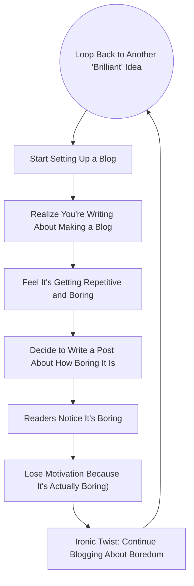

# Setting Up a Boring Markdown Tech Blog in 2025

I'm sharing *how* I'm creating my blog *while* I'm creating my blog. 

We'll be using [MkDocs](https://www.mkdocs.org/) and [Material for
MkDocs](https://squidfunk.github.io/mkdocs-material/). You'll look a bit like a
corporate drone, but you'll apppreciate how easy and full-featured it is for
code examples and diagrams and stuff that you want to show on a boring tech
blog.

We'll use [uv](https://docs.astral.sh/uv/concepts/tools/) to isolate
`mkdocs-material` dependencies, so we'll dip our toes in managing Python versions
and packages.

<!-- more -->

## Before Getting Started

I want to document some things I do in a project like this that I'd normally
skip over. I hope it'll benefit you!

### Making Cursor Less Annoying

I'm editing this markdown file in [Cursor](https://www.cursor.com/), the "Pro"
tier at the moment. They reserve the Cursor chat (<kbd>⌘</kbd> +
<kbd>l</kbd>[^1]) for the upgrade (did at least when I upgraded), it's a killer
feature.

However, LLM autocomplete is annoying for markdown. How would it know what I
want to write before I write it? I think by writing, so LLM completion is a
terrible idea for MD files for me. So type <kbd>⌘</kbd> + <kbd>shift</kbd> +
<kbd>p</kbd>, go to "Preferences: Open User Settings (JSON)", and add this:
```json
"cursor.cpp.disabledLanguages": [
    "markdown"
]
```

Couldn't I just use VSCode for this? Sure, but it's nice to have an LLM at your
disposal for later proofreading, and mindless content rearranging and stuff.

### Wrapping Markdown

We're tech folks and we're paranoid about others critiquing our source files, so
we want our lines to wrap at a certain line length. Likely you're reading on the
rendered HTML version of this blog, but hey, install [Rewrap] so we can select
text and <kbd>alt</kbd> + <kbd>q</kbd> to wrap lines. I mean, it's kinda nicer
to read in the editor too as I type. Why? We aren't used to reading [too many
words on a line][butterick][^2].

Bored yet? Mission accomplished, this is a boring blog post about a boring tech
blog.

### Init the Git

You know this!
```sh
mkdir tallpauley-blog
cd tallpauley-blog
git init
```
I won't get into Git usage much, but I'm going to "commit early, commit often,
especially with this file `tech-blog.md`, so I don't lose any writing! I will
mention, I use [oh my zsh](https://ohmyz.sh/) for git aliases, who wants to
type?

### Managing CPython and Package Versions

Ok, this part historically has been a chore, but I think it's getting
better/easier. My last project I used [mise-en-place](https://mise.jdx.dev/) and
[Poetry](https://python-poetry.org/), but I just tried
[uv](https://docs.astral.sh/uv/) and it can replace both of these tools for this
use case (`mise`'s thing is that it works across Python, NodeJS, Ruby, etc.)

[Install uv](https://docs.astral.sh/uv/getting-started/installation/), and do
this:

```sh
# install latest CPython. This is fast since Astral (creators of uv) build Python
# binaries for your system (you can install PyPy binaries too which is cool!)
uv python install

# init project (creates pyproject.toml, .python-version, hello.py)
uv init
```

I now have a `.python-version` file, which is also what
[pyenv](https://github.com/pyenv/pyenv) does. Let's try Python 3.13:
```sh
uv run python
```

If we're Pythonistas and "explicit is better than implicit", I think this is
definitely more explicit than `mise`'s approach of taking over the `python`
command for the current working directory. And I previously had to install some
plugin to get `mise` and `poetry` to work together. No more!

## Actually Getting Started

### Installing MkDocs and Material for MkDocs w/ `uv`

All we need to do is:
```sh
uv add mkdocs-material
```

This created a Virtual Environment in `.venv` (more editor-friendly than
Poetry's default of installing venvs elsewhere!), and installed
`mkdocs-material`, which required `mkdocs`, so we're all good to blog!

### Bootstrapping the Blog

I'm following the [Creating Your
Site](https://squidfunk.github.io/mkdocs-material/creating-your-site/) guide at
the MkDocs material site:
```sh
uv run mkdocs new .
```

Open `mkdocs.yml` and udpate it with this:
```yaml
site_name: Chris Pauley's Technical Blog
site_url: https://chrispauley.io/blog
theme:
  name: material
```

Then I should be able to serve my blog locally to preview it!
```sh
uv run mkdocs serve
```

Check it out at `http://localhost:8000`!

### Configuring/Structuring the Blog

Ok, "it's not really a blog", you say. Yet! We need to to set up `mkdocs.yml`
[for a
blog](https://squidfunk.github.io/mkdocs-material/setup/setting-up-a-blog/) (as
well as footnotes, code highlighting, code copy, mermaidjs, etc)

```yaml
site_name: Chris Pauley's Technical Blog
site_url: https://chrispauley.io/blog
theme:
  name: material
  features:
    - content.code.copy
  palette:
    primary: blue
plugins:
- blog:
    blog_dir: . 
markdown_extensions:
  - pymdownx.superfences:
      custom_fences:
        - name: mermaid
          class: mermaid
          format: !!python/name:pymdownx.superfences.fence_code_format
  - footnotes
  - pymdownx.highlight:
      anchor_linenums: true
      line_spans: __span
      pygments_lang_class: true
  - pymdownx.inlinehilite
  - pymdownx.snippets
  - pymdownx.superfences
```

I put this file (`tech-blog.md`) in `docs/posts/`, so the directory structure now looks like:
```
docs/
  index.md (empty file)
  posts/
     tech-blog.md
```

Then I added this to the top of `tech-blog.md`
```yaml
---
date: 2025-01-28
---
```

If you check out the site being served locally, it should look very blogesque!

## Diagrams for Days

People in the corporate world might not take you seriously without diagrams, so I prompted
ChatGPT o1 with the following (conversing to fix the output): 

> Draw a mermaid JS diagram that shows how boring blogging about making a blog is

"Boring" isn't really the word, more like "tedious", or "tiresome"? Idk, here it what it gave me:



Mermaid is set up correctly! Diagram City.

## Publish It

Ok, it's getting tiresome blogging about setting up my blog while I'm setting up my blog. Let's publish it!

First I just need to set up my DNS[^4]. I forgot I had tallpauley.com! Just:

- Followed [this guide to verify ownership of your domain][verify-custom-domain] 
- Followed [this guide to set up your custom domain][managing-custom-domain] 

I remembered from publishing [wordsiv.com] that I need a `docs/CNAME` file:
```sh
echo tallpauley.com > docs/CNAME
```

All we need is Github actions to deploy it. I showed you `uv`, but I'm kinda
over this blog so let's just paste this [GitHub Actions
Workflow](material-publish) into `.github/workflows/ci.yml` and call it a day!

Now I'm just going to push to 


[^1]: Googled "Keyboard Shortcut Markdown, found [this gist, this giiiist](https://gist.github.com/bittner/f3e2804e06c663510e939ca569ee483e]) (to the tune of Shania Twain).
[^2]: Definitely check out [Butterick's Practical Typography](https://practicaltypography.com/)! Great resource.
[^3]: Eventually I'll set up GitHub Actions for the CI/CD
[^4]: Which is now in Squarespace. RIP Google Domains.

[uv-features]: https://docs.astral.sh/uv/getting-started/features/
[Rewrap]: https://marketplace.visualstudio.com/items?itemName=stkb.rewrap
[butterick]: https://practicaltypography.com/typography-in-ten-minutes.html
[verify-custom-domain]: https://docs.github.com/en/pages/configuring-a-custom-domain-for-your-github-pages-site/verifying-your-custom-domain-for-github-pages
[managing-custom-domain]: https://docs.github.com/en/pages/configuring-a-custom-domain-for-your-github-pages-site/verifying-your-custom-domain-for-github-pages
[material-publish]: https://squidfunk.github.io/mkdocs-material/publishing-your-site/#with-github-actions-material-for-mkdocs